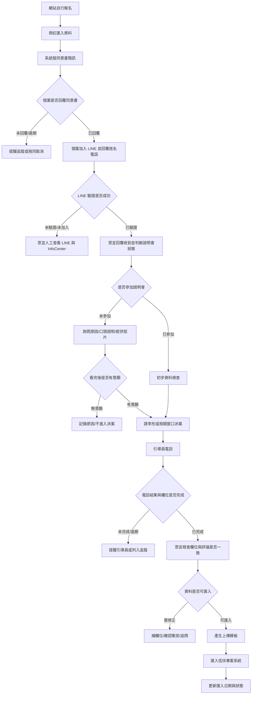
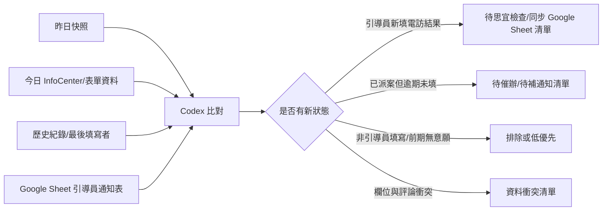
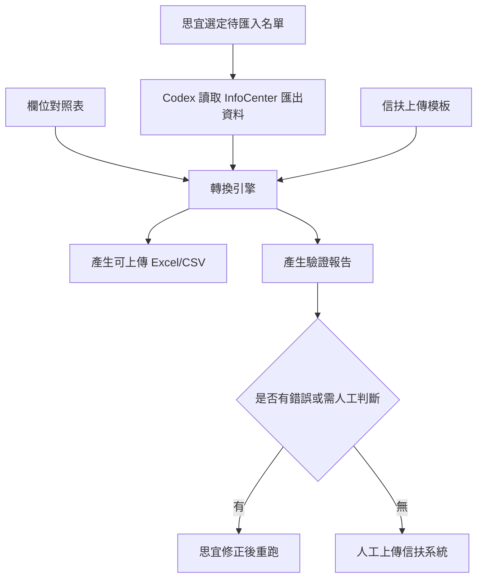

# 思宜需求分析與 Codex 自動化任務規劃

來源：訪談逐字稿與會後紀錄
目標：把思宜目前在「自行報名案、同意書、LINE、引導員電訪、信扶系統匯入」中的人工判斷工作，轉換成可檢查、可提醒、可半自動化的工作流。

## 1. 任務分流

任務類型：Workflow / Operations / Documentation
完成定義：產出一份可讓 Kevin 與思宜討論的需求分析稿，包含可視化流程、Codex 自動化任務規劃、可能解法、風險與待確認事項。
建議代理視角：`task_router` 定義範圍、`context_scout` 抽取逐字稿事實、`workflow_designer` 設計流程、`automation_auditor` 劃出自動化邊界、`doc_scribe` 整理成可讀提案。
審核門檻：目前只做草案；任何外部系統寫入、LINE 發送、長期排程、帳號權限存取，都需要 Kevin 與業務端確認後才執行。

## 2. 一頁摘要

思宜的核心需求不是「讓 AI 直接替她處理個案」，而是：

1. 幫她知道今天該看誰、該追誰、誰有新狀態。
2. 幫她找出關鍵欄位、異常欄位、衝突欄位。
3. 幫她把跨系統的資料搬移、欄位對齊、上傳格式整理先做好。
4. 保留人工判斷與外部發送的最後確認權。

最適合先做的 MVP 是「每日提醒清單 + 欄位檢查報告 + 匯入模板產生器」，不建議一開始就做 LINE 自動回覆或直接寫入外部系統。

## 3. 角色與系統地圖

| 類別 | 對象 | 目前角色 |
| --- | --- | --- |
| 人 | 個案 | 網站報名、回覆同意書、加入 LINE、參加說明會或看短片、接受電訪 |
| 人 | 雨虹 | 將網站報名資料匯入系統、發送同意書簡訊、開同意書事件 |
| 人 | 思宜 | 同意書追蹤、LINE 檢查、初步資格判斷、說明會/短片引導、引導員電訪後檢查、匯入信扶系統 |
| 人 | 引導員 | 於派案後完成第一次聯繫與電訪，填寫電訪結果/評論 |
| 系統 | InfoCenter | 個案資料、LINE 驗證狀態、欄位、歷史紀錄、事件 |
| 系統 | LINE 官方帳號 | 個案加入與訊息往來，但目前缺少主動通知 |
| 系統 | Google Sheet / 引導員通知表 | 各引導員名單、七天內聯繫追蹤、通知狀態、問題註記 |
| 系統 | 信扶專案系統 / 上傳模板 | 最終匯入與狀態更新 |
| 工具 | Codex | 讀取、比對、產生提醒、整理模板、輔助更新，但外部寫入需人工核准 |

## 4. 可視化流程圖

## 5. 需求切片

### A. 自行報名案：同意書、LINE、狀態判斷與通知

目前流程：

- 網站報名後，由雨虹匯入並開同意書事件。
- 系統簡訊通知個案在期限前回覆輔導同意書。
- 個案回覆後，理想情況是加入官方 LINE，回覆姓名與電話。
- LINE 驗證成功時，InfoCenter 會顯示 LINE 連結狀態。
- 思宜目前需要三不五時人工檢查 LINE 與 InfoCenter，沒有主動通知。

痛點：

- 新加入 LINE 或新回覆同意書沒有即時通知。
- 同意書、LINE 驗證、說明會狀態、個案資料散在不同地方。
- 有些判斷高度仰賴思宜經驗，不適合一開始全自動。

可自動化方向：

| 條件 | 建議輸出 | 自動化等級 |
| --- | --- | --- |
| 已回覆同意書但未 LINE 驗證 | 每日提醒名單 | 讀取/提醒 |
| 已 LINE 驗證但尚未回覆歡迎訊息 | 今日待回覆清單 | 讀取/提醒 |
| 未參加說明會但可能仍有意願 | 提醒思宜詢問原因或提供短片 | 草稿提醒 |
| 警示帳戶 | 優先電話聯繫名單 | 高優先提醒 |
| 特殊境遇家庭 | 詢問是否有社會局公文 | 提醒或訊息草稿 |

### B. 關鍵欄位與資料正確性檢查

思宜明確提到，比起前段 LINE 互動，欄位正確性更適合自動化。

可檢查規則：

| 欄位/情境 | 檢查目的 | 建議動作 |
| --- | --- | --- |
| 身分證字號與性別 | 例如身分證第二碼與性別欄衝突 | 列為資料錯誤 |
| 子女學齡與是否同住 | 思宜一定會問，可提醒尚未確認者 | 產生固定詢問清單 |
| 特殊境遇家庭 | 需確認是否有社會局公文 | 提醒 LINE 詢問 |
| 警示帳戶 | 影響是否能申請貸款相關資源 | 優先電話名單 |
| InfoCenter 背景欄位 vs 電訪評論 | 避免評論有資料但欄位空白，或兩者衝突 | 產生欄位修正/衝突報告 |
| 有意願但事件未開或狀態未更新 | 避免行政流程漏接 | 列為待補事件 |

### C. 引導員電訪追蹤

目前流程：

- 有意願名單由相關窗口派案給引導員。
- 20 多位引導員各自有提醒表，需在期限內完成第一次聯繫與電訪。
- 引導員不一定主動回報，思宜要自己開表與 InfoCenter 查。
- 電訪結果除了記錄在 InfoCenter，也需要填寫 Google Sheet，作為引導員通知與後續追蹤依據。
- 電訪結果欄位可能由引導員、思宜、或其他角色填寫。
- 思宜真正需要的是「引導員完成後，我要知道該檢查了」以及「逾期未完成，我要知道該追了」。

重要限制：

- 不能只看「電訪結果欄位有沒有資料」，因為思宜或內部人員也可能在前期填寫無意願、三通未接等結果。
- 需要看歷史紀錄或最後填寫者，判斷是否為引導員完成。
- 也不能只看 InfoCenter，因為 Google Sheet 通知表是否已更新，會影響引導員通知與追蹤。
- 若系統可讀取歷史紀錄，Codex 可以用「最後更新者 + 更新時間 + 欄位值 + 案件狀態」來降低誤報。

建議提醒邏輯：

### D. 信扶專案系統匯入

目前流程：

- 思宜人工確認要匯入的名單。
- 到 InfoCenter 搜尋名字、勾選名單、下載完整欄位資料。
- 將資料複製到上傳模板。
- 手動刪除多個空白欄位或不需要欄位，使答案與標題對齊。
- 做少數欄位的額外判斷。
- 上傳後，再回到系統更新子女欄位、匯入日期、狀態「已匯入」等。

痛點：

- 欄位對齊高度手工，容易貼錯、漏欄、格式錯。
- 下載檔與上傳檔是兩種不同結構，形成「visual gap」。
- 上傳後還要回寫狀態，容易漏掉行政收尾。

可自動化方向：

1. 由 Codex 根據「名單 + InfoCenter 匯出檔 + 上傳模板」直接產生可上傳檔。
2. 產生前做欄位驗證報告：缺值、格式錯、衝突、需人工判斷欄位。
3. 上傳後，先產生「待更新狀態清單」；若未來確認瀏覽器自動化穩定，再做半自動回寫。

## 6. 思宜目前工作流程

從逐字稿來看，思宜現在的工作流程可以還原成六個主要步驟：

| 步驟 | 現在怎麼做 | 主要負擔 |
| --- | --- | --- |
| 1. 報名與同意書 | 雨虹將網站報名資料匯入系統並開同意書事件，簡訊通知個案回覆輔導同意書 | 思宜需要知道誰已回覆、誰逾期、誰要進下一步 |
| 2. LINE 加入與驗證 | 個案加入官方 LINE，回覆姓名與電話；驗證成功後 InfoCenter 的 LINE 狀態會連結成綠色 | 沒有主動通知，需要人工反覆查看 |
| 3. 說明會與初篩 | 思宜確認是否參加說明會；未參加者詢問原因、口頭說明或提供短片 | 要判斷個案是否理解專案、是否仍有意願 |
| 4. 關鍵欄位確認 | 固定詢問子女學齡與是否同住；特殊境遇需問公文；警示帳戶通常直接電話說明 | 需要快速抓出會影響下一步的欄位 |
| 5. 派案與電訪追蹤 | 有意願者派案給引導員；引導員電訪後，思宜檢查電訪結果、評論與 InfoCenter 欄位，並回填 Google Sheet 作為引導員通知與追蹤依據 | 20 多位引導員不一定主動回報，InfoCenter 與 Google Sheet 也可能不同步 |
| 6. 匯入信扶系統 | 思宜確認可匯入名單，下載 InfoCenter 欄位資料，整理成信扶上傳模板，再回寫匯入日期與狀態 | 欄位刪減、對齊、格式確認耗時且容易出錯 |

這個流程的關鍵不是單點操作，而是「跨系統狀態追蹤」。思宜需要的是每天知道哪些個案狀態改變、哪些欄位有異常、哪些資料已經可以進下一步。

## 7. 優化可能性判斷

有優化空間，而且最適合的方向是「先整理清單，再逐步半自動化」，不是一開始就全自動處理個案。

| 優化方向 | 可行性 | 原因 |
| --- | --- | --- |
| 每日變更提醒 | 高 | 可比對昨日與今日資料，列出新回覆同意書、LINE 未驗證、引導員新完成電訪、逾期未完成電訪、Google Sheet 待更新通知 |
| 欄位品質檢查 | 高 | 身分證/性別、特殊境遇、警示帳戶、背景欄位與電訪評論衝突都適合規則化 |
| 信扶上傳模板產生器 | 高 | 現在手工欄位對齊成本高，且資料來源與目標模板相對固定 |
| LINE 回覆草稿 | 中 | 可協助產生草稿，但不建議自動送出 |
| 事件開立或狀態回寫 | 中 | 規則穩定後可以半自動處理，但送出前應由人確認 |
| 自動資格判定/自動取消個案 | 低 | 個案情境複雜，容易需要人工判斷，不適合第一階段 |

建議先做讀取型 MVP：

1. 只產出每日提醒報告、欄位衝突報告、信扶上傳檔。
2. 不自動發 LINE、不自動取消、不自動判斷資格、不自動寫入外部系統。
3. 用 1 至 2 週核對誤報與漏報。
4. 規則穩定後，再考慮半自動回寫與瀏覽器助手。

## 8. 可協助項目與資料準備

以下把可協助的方向轉成可執行模組。第一性原則是先確認資料來源、觸發條件與輸出物，讓 Codex 只做清單、判斷輔助與檔案產出；外部寫入與正式通知仍保留人工確認。

| 可協助項目 | 觸發時機 | 資料來源 | 輸出物 | 需要準備 |
| --- | --- | --- | --- | --- |
| 每日讀取 InfoCenter 案件狀態與新增個案 | 每日固定時間，或思宜手動執行 | InfoCenter API，資料範圍限「馴錢師財商顧問股份有限公司」單位內案件 | 新增個案、狀態變更、待追蹤清單 | API base URL、認證方式、單位 ID、案件列表與詳情欄位 |
| 特殊欄位初步判斷與動作建議 | 新增個案或欄位更新後 | InfoCenter 個案欄位、歷史紀錄、思宜提供的規則 | 例如警示帳戶需電話、特殊境遇需問公文、資料衝突需補問 | 思宜列出哪些特殊欄位會觸發哪些動作，以及例外情境 |
| 說明會前整理未參加名單 | 說明會前一天或指定時間 | InfoCenter 說明會報名/參加狀態、同意書與 LINE 狀態 | 未參加說明會名單表格，含聯繫資訊、目前狀態、建議聯繫話術 | 說明會場次 ID、日期區間、未參加定義、表格欄位格式 |
| 派案後定期檢查引導員完成狀態 | 派案後每日或每週固定排程 | InfoCenter 派案/電訪欄位、Google Sheet 引導員通知表 | 完成、逾期、待補欄位、InfoCenter 與 Google Sheet 不一致清單 | 派案日期欄位、逾期規則、Google Sheet 欄位、哪些狀態可自動更新 |
| 產生信扶系統可匯入檔案 | 思宜指定匯入名單與範圍後 | InfoCenter 個案資料、信扶上傳模板、欄位 mapping | 符合信扶模板的 Excel/CSV 檔，另附缺值與需人工確認清單 | 信扶模板、可匯入規則、固定範圍空間、欄位轉換規則 |

## 9. Codex 自動化可能的任務規劃

### Phase 0：盤點與規則定義

目的：先把目前流程變成可機器判讀的規則與欄位表。

輸入：

- InfoCenter 個案匯出樣本。
- 信扶系統上傳模板。
- Google Sheet 引導員通知表樣本。
- LINE 驗證欄位或 InfoCenter LINE 狀態樣本。
- 歷史紀錄樣本，尤其是欄位更新者與更新時間。

產出：

- 欄位對照表。
- 狀態定義表。
- 自動化排除規則。
- 第一版提醒規則。

### Phase 1：每日讀取型提醒報告

目的：先不改任何外部系統，只產生思宜每天可看的清單。

建議排程：每天上午固定時間執行一次，或手動執行。

輸出清單：

| 清單 | 判斷條件 | 用途 |
| --- | --- | --- |
| 今日新同意書回覆 | 新增同意書回覆，但未完成下一步 | 追 LINE/說明會 |
| 已回覆但未 LINE 驗證 | 同意書完成，但 LINE 狀態未綠燈 | 補追加入 LINE |
| 警示帳戶 | 欄位顯示警示帳戶 | 優先電話 |
| 特殊境遇家庭 | 身分別包含特殊境遇 | 詢問公文 |
| 引導員新完成電訪 | InfoCenter 電訪欄位或 Google Sheet 通知狀態出現新完成紀錄 | 思宜檢查資料，並確認兩邊狀態一致 |
| 逾期未完成電訪 | 派案超過規定天數，InfoCenter 無電訪結果或 Google Sheet 尚未更新 | 催辦或追蹤引導員，必要時補更新通知表 |
| 欄位/評論衝突 | 背景欄位與電訪評論不一致 | 人工修正 |

### Phase 2：資料品質檢查器

目的：讓思宜不用逐筆閱讀才知道哪裡可能有問題。

功能：

- 身分證/性別一致性檢查。
- 必問欄位是否已確認。
- 特殊身份是否需補證明。
- 警示帳戶是否需電話處理。
- 電訪評論中提到的內容是否未回填欄位。
- 有意願但事件/狀態未補。
- 無意願或三通未接等前期結果是否應排除引導員完成清單。

### Phase 3：信扶上傳模板產生器

目的：減少複製貼上與欄位刪減。

流程：

### Phase 4：半自動外部系統更新

目的：在報告與模板穩定後，再考慮讓 Codex 開瀏覽器輔助更新。

可做：

- 開啟 InfoCenter 或信扶系統。
- 根據已確認名單填入匯入日期。
- 將狀態改成已匯入。
- 開指定事件或勾選指定欄位。

限制：

- 每次送出前要人工確認。
- 不自動發 LINE。
- 不自動判定個案資格。
- 不自動取消個案。

## 10. 可能的解決方案

### 解法一：Google Sheet / Excel 版提醒儀表板

適合先做。

做法：

- 每天把 InfoCenter 匯出檔、Google Sheet 引導員通知表資料放入固定資料夾。
- Codex 或腳本讀取資料，與昨日快照比對。
- 產生一份 Google Sheet / Excel 報告。

優點：

- 不需要一開始串接外部系統。
- 容易驗證規則是否符合思宜實務。
- 可用人工匯出資料降低權限風險。

缺點：

- 還是需要人工下載或整理來源檔。
- 即時性較低，偏每日批次。

### 解法二：InfoCenter + Sheets 半自動監控

適合 MVP 驗證後做。

做法：

- Codex 以瀏覽器或既有 API 讀取 InfoCenter。
- 讀取 Google Sheet 引導員通知表。
- 保留昨日快照。
- 每日產生變更清單。

優點：

- 降低人工打開 20 多份表的時間。
- 可辨識「新完成」而不是只看欄位是否有值。

缺點：

- 需要確認登入、權限、資料欄位穩定性。
- 歷史紀錄的讀取方式需要先測。

### 解法三：信扶匯入模板產生器

高價值，建議並行設計。

做法：

- 建立 InfoCenter 欄位到信扶模板欄位的 mapping。
- 對每個欄位定義轉換規則。
- 產生可上傳檔與錯誤報告。

優點：

- 直接減少最容易出錯的手工欄位對齊。
- 可獨立於 LINE/提醒流程先完成。

缺點：

- 需要拿到真實或去識別化的範例檔。
- 少數欄位的人工判斷規則需思宜確認。

### 解法四：人工核准式瀏覽器助手

適合後期。

做法：

- Codex 打開系統、定位個案、預填欄位。
- 在送出前停下，讓思宜確認。

優點：

- 可減少重複點擊與資料回填。

缺點：

- 對系統 UI 變更較敏感。
- 涉及外部寫入，必須有清楚審核與 rollback 記錄。

## 11. 建議優先順序

| 優先 | 項目 | 原因 |
| --- | --- | --- |
| P0 | 每日引導員電訪變更/逾期提醒 | 思宜明確說目前沒時間追，且引導員不主動回報；電訪結果還需要同步 Google Sheet 通知表 |
| P0 | 信扶上傳模板產生器 | 手工欄位對齊高耗時且高錯誤率 |
| P1 | 欄位正確性與衝突檢查 | 思宜明確覺得這塊比 LINE 自動化更適合 |
| P1 | 同意書/LINE/說明會狀態清單 | 有幫助，但前段仍需大量人工判斷 |
| P2 | 自動開事件/回寫狀態 | 有價值，但要等規則穩定與權限確認 |
| P2 | LINE 訊息草稿 | 可做草稿，不建議一開始自動發送 |

## 12. 需要再確認的問題

1. InfoCenter 中同意書、LINE 驗證、說明會、警示帳戶、特殊境遇、子女學齡/同住、電訪結果的實際欄位名稱是什麼？
2. 歷史紀錄是否能看到「更新者、更新時間、更新欄位、更新前後值」？
3. 哪些帳號/角色算是引導員？哪些算是思宜或內部人員？
4. 「引導員完成電訪」的精準條件是什麼？只要有電訪結果，還是需要特定事件/狀態？
5. Google Sheet 引導員通知表的欄位、更新責任與完成狀態定義是什麼？
6. 逾期規則是派案後 7 天、第一次聯繫後 7 天，還是其他日期基準？
7. 信扶上傳模板的固定欄位與必填欄位有哪些？
8. 哪些匯入欄位需要人工判斷，不能完全 mapping？
9. 上傳後需要回寫哪些系統欄位？例如匯入日期、已匯入狀態、子女欄位、事件。
10. 是否可以先使用去識別化樣本檔做測試？
11. 報告要給思宜在哪裡看最方便：Email、Google Sheet、Markdown、LINE 草稿，還是 Codex 產出的 HTML 報告？

## 13. MVP 建議

第一輪不要做大系統，做「讀取型工具」：

1. 思宜或 Kevin 提供去識別化的 InfoCenter 匯出檔、信扶上傳模板、Google Sheet 引導員通知表樣本。
2. 建立欄位 mapping 與規則表。
3. 產生每日提醒報告範本。
4. 產生信扶上傳模板草稿。
5. 用 1 至 2 週人工核對誤報/漏報。
6. 規則穩定後，再決定是否做排程與瀏覽器半自動回寫。

## 14. Governance Review Card

What changed：本文件只提出自動化候選與流程設計，尚未建立實際 automation。
Why needed：思宜工作橫跨 LINE、InfoCenter、Google Sheet、信扶系統，人工追蹤成本高。
Owner agent：`workflow_designer` 與 `automation_auditor`。
Trigger：每日固定檢查、手動匯入前檢查、引導員電訪完成後檢查。
Should not do：不自動發送 LINE、不自動取消個案、不自動判定資格、不自動寫入外部系統。
Proof：每日提醒報告、欄位衝突報告、上傳模板驗證結果、人工核對紀錄。
Approval required：外部寫入、長期排程、帳號權限、LINE 發送、正式上傳信扶系統前都需人工確認。
Source of truth：待建立欄位 mapping 表、規則表、樣本檔與 MVP 驗證記錄。
Promotion fit：目前應保持 local draft / MVP，不應直接升級為全自動長期流程。
